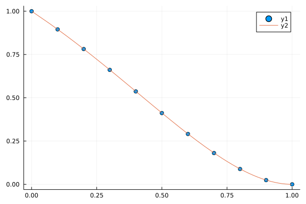

# Teoría, Práctica y Aplicaciones de los Elementos Finitos
## Tarea I
### Curso de Posgrado en Matemáticas-UNAM

> Profesor: Daniel Castañon Quiroz. daniel.castanon@iimas.unam.mx

> Alumno: Mario Rafael Nolasco Estrada. mnolasco@ciencias.unam.mx

# Problema 2

Aproximar numéricamente utilizando los elementos finitos de Lagrange de primer orden la solución débil del siguiente problema con valores en la frontera:

$$-u''(x)+u'(x)+u(x) = f(x),\qquad x\in D := [0,1],$$

con las condiciones de frontera $u(0) =1\ , \  u'(1) =0$.

donde $f(x)=-2e^x+2(1-x)e^x+(1-x)^2e^x$. Observar que $u(x)=(1-x)^2e^x$ es la solución del problema. Obtener entonces la tasa de convergencia para el error $e:=u_h-u$ en las normas $L_2(D)$ y $H_1(D)$ para $N=10, 20, 40, 80, 160$ donde $N$ es el número de subintervalos que dividen a $D$.

## Solución

Dada la partición del intervalo $[a,b]$ en $n$ intervalos: 
$a = x_1 < x_2 <x_3 <\ldots < x_n < x_{n+1}=b$

Definimos: 
$h_i = x_{i+1}-x_i \quad I_i : = x\in [x_i, x_{i+1} ]$

Tomamos los elementos finitos de Lagrange: $\left\lbrace \phi_1, \phi_2, \ldots, \phi_{n+1}  \right\rbrace $

con $$ \phi_i(x) := \begin{cases}  \frac{x-x_{i-1}}{h_{i-1}}  & x\in [x_{i-1},x_i]= I_{i-1} \\ 1-\frac{x-x_{i}}{h_{i}}  & x\in [x_{i},x_{i+1}]= I_{i}\\ 0 & \text{ otro caso}\end{cases} \quad ; \quad \phi_i(x)' := \begin{cases}  \frac{1}{h_{i-1}}  & x\in I_{i-1} \\ -\frac{1}{h_{i}}  & x\in I_{i}\\ 0 & \text{ otro caso}\end{cases} $$

Entonces el problema 

Se convierte en $$a(u,v)=(f,v)$$ con $$a(u,v)=\int_{D} u'v'+u'v+uv =  \quad (f,v) =\int_{D} f(x) v(x)dx  $$

Ahora si tomamos $u$ y $v$ tales que: $$u = \sum_{i=1}^{n+1} u_i \phi_i\quad v = \sum_{i=1}^{n+1} v_i \phi_i $$ 


$a(u,v)-(f,v)=0$ se convierte en:
$$\sum_{i=1}^{n+1} v_i \left [ \sum_{j=1}^{n+1}\int_{D} \left( \phi_i'\phi_j'+\phi_i'\phi_j+\phi_i\phi_j\right)u_j - \int_{D}f\phi_i  \right] =0$$
donde $$ \sum_{j=1}^{n+1}\int_{D} \left( \phi_i'\phi_j'+\phi_i'\phi_j+\phi_i\phi_j\right)u_j = \int_{D}f\phi_i \quad i=1,2,\ldots n+1 $$ es un sistema de $n+1$ ecuaciones.

En forma matricial: $$Au=b$$

con $$A_{ij}=\int_{D} \left( \phi_i'\phi_j'+\phi_i'\phi_j+\phi_i\phi_j\right) \quad \text{y} \quad b_i =\int_{D} f \phi_i $$

Ya que los soportes de $\phi_i$ y $\phi_{i+2}$ se intersectan solo en el punto $\left\lbrace x_{i+1} \right\rbrace$, entonces el coeficiente $A_{ij}$ se anula si $|i-j|\geq 2$


Para $j=i$, tenemos que 
$$A_{ii}=\int_{D} \phi_i'\phi_i' 
= \int_{x_{i-1}}^{x_{i+1}} \left( \phi_i'\phi_i'+\phi_i'\phi_i+\phi_i\phi_i\right)
=\int_{x_{i-1}}^{x_{i}} \left( \phi_i'\phi_i'+\phi_i'\phi_i+\phi_i\phi_i\right)+\int_{x_{i}}^{x_{i+1}} \left( \phi_i'\phi_i'+\phi_i'\phi_i+\phi_i\phi_i\right)
$$

Para $j=i\pm 1$, tenemos que 
$$A_{i,i+1}=\int_{D}  \phi_i'\phi_{i+1}'+\phi_i'\phi_{i+1}+\phi_i\phi_{i+1} = \int_{x_{i}}^{x_{i+1}}  \phi_i'\phi_{i+1}'+\phi_i'\phi_{i+1}+\phi_i\phi_{i+1}$$
$$A_{i,i-1}=\int_{D}  \phi_i'\phi_{i-1}'+\phi_i'\phi_{i-1}+\phi_i\phi_{i-1} = \int_{x_{i-1}}^{x_{i}}  \phi_i'\phi_{i-1}'+\phi_i'\phi_{i-1}+\phi_i\phi_{i-1}$$

Entonces en el intervalo $[x_i, x_{i+1}]$ se actualizan los siguientes coeficientes de la matriz $A$:
$$A_{ii}\leftarrow \int_{x_{i}}^{x_{i+1}} \left( \left( \phi_i^{-}\right)'\left( \phi_i^{-}\right)'+\left( \phi_i^{-}\right)'\left( \phi_i^{-}\right)+\left( \phi_i^{-}\right)\left( \phi_i^{-}\right)\right)=  a\left( \phi_i^{-},\phi_i^{-} \right) $$
$$A_{i+1,i+1}\leftarrow \int_{x_{i}}^{x_{i+1}} \left( \left( \phi_{i+1}^{+}\right)'\left( \phi_{i+1}^{+}\right)'+\left( \phi_{i+1}^{+}\right)'\left( \phi_{i+1}^{+}\right)+\left( \phi_{i+1}^{+}\right)\left( \phi_{i+1}^{+}\right)\right)=a\left(\phi_{i+1}^{+},\phi_{i+1}^{+} \right) $$

$$A_{i,i+1}\leftarrow \int_{x_{i}}^{x_{i+1}}  \left( \phi_{i}^{-}\right)'\left( \phi_{i+1}^{+}\right)'+\left( \phi_{i}^{-}\right)'\left( \phi_{i+1}^{+}\right)+\left( \phi_{i}^{-}\right)\left( \phi_{i+1}^{+}\right) = a\left( \phi_{i}^{-}, \phi_{i+1}^{+}\right) $$

$$A_{i+1,i}\leftarrow \int_{x_{i}}^{x_{i+1}} \left( \phi_{i+1}^{+}\right)'\left( \phi_{i}^{-}\right)'+\left( \phi_{i+1}^{+}\right)'\left( \phi_{i}^{-}\right)+\left( \phi_{i+1}^{+}\right)\left( \phi_{i}^{-}\right) = a \left( \phi_{i+1}^{+}, \phi_{i}^{-}\right) $$

Y para el vector $b$ tenemos:
$$ b_i \leftarrow \int_{x_{i}}^{x_{i+1}} f \phi_{i}^{-} $$
$$ b_{i+1} \leftarrow \int_{x_{i}}^{x_{i+1}} f  \phi_{i+1}^{+} $$


```julia
using LinearAlgebra
```


```julia
# Definición de la función u_exact
function u_exact(x)
    return exp(x)*(1-x)^2
end

# Definición de la función du_exact
function du_exact(x)
    return  exp(x)*(x^2 - 1)
end
```


    du_exact (generic function with 1 method)


```julia
"""
    cuadratura(f, a, b)

Aproxima el valor de la integral de la función `f` en el intervalo `[a,b]` utilizando
la fórmula de cuadratura de Gauss-Legendre con tres nodos.

# Argumentos
- `f`: Función a integrar.
- `a`: Límite inferior del intervalo de integración.
- `b`: Límite superior del intervalo de integración.

# Salida
- `val`: Aproximación del valor de la integral de `f` en el intervalo `[a,b]`.

# Ejemplo
```julia
f(x) = exp(x)
a, b = 0, 1
approx = cuadratura(f, a, b)
"""
function cuadratura(f,a,b)
        # Nodos de la cuadratura
        x₁ = -0.5* (b-a) *sqrt(3/5)+0.5*(a+b)  # Nodo x₁
        x₂ = 0.5*(a+b)                         # Nodo x₂
        x₃ = 0.5*(b-a)*sqrt(3/5)+0.5*(a+b)     # Nodo x₃
    
        # Cálculo de integral utilizando la fórmula de cuadratura de Gauss-Legendre
        val = 5*f(x₁)+8*f(x₂)+5*f(x₃)         # Suma ponderada de f en los nodos
        val = 0.5*(b-a)*(1/9)*val              # Multiplicación por el factor de escala
    
    return val  # Retorna el valor aproximado de la integral de f en [a,b]
end
```


    cuadratura


```julia
# Definición de la función error_elemento 
"""
Función que calcula el error de aproximación en la norma L2
y en la seminorma H1 en un elemento de la malla.

Input:
- nodes: vector con los nodos de la malla
- dofs: vector con los grados de libertad de la solución
- i: índice del elemento en la malla

Output:
- val_L2: valor del error L2 en el elemento
- val_H1: valor del error H1 en el elemento
"""
function error_elemento(nodes, dofs, i)    
    # Obtención de las coordenadas de los nodos y los dofs
    xᵢ = nodes[i]
    xᵢ₊₁ = nodes[i+1]
    uᵢ = dofs[i]
    uᵢ₊₁ = dofs[i+1]
    
    # Definición de funciones sombrero anónimas para aproximar la solución
    hatᵢ = x -> uᵢ*(1 - (x - xᵢ)/(xᵢ₊₁ - xᵢ))
    hatᵢ₊₁ = x -> uᵢ₊₁*(x - xᵢ)/(xᵢ₊₁ - xᵢ)
    
    # Definición de las derivadas de las funciones sombrero
    dhatᵢ = x-> -uᵢ/(xᵢ₊₁ - xᵢ)
    dhatᵢ₊₁ = x-> uᵢ₊₁/(xᵢ₊₁ - xᵢ)
        
    # Cuadratura de Gauss para aproximar la integral
    # Nodos de la cuadratura
        x₁ = 0.5*(xᵢ₊₁-xᵢ)*(1-sqrt(3/5))+xᵢ
        x₂ = 0.5*(xᵢ₊₁+xᵢ)
        x₃ = 0.5*(xᵢ₊₁-xᵢ)*(1+sqrt(3/5))+xᵢ        
    # Solución y derivada en los nodos
        u₁ = u_exact(x₁)
        u₂ = u_exact(x₂)
        u₃ = u_exact(x₃)
        du₁ = du_exact(x₁)
        du₂ = du_exact(x₂)
        du₃ = du_exact(x₃)
    # Cálculo del error L2 y H1
        val_L2 = 5*(u₁ - hatᵢ(x₁) - hatᵢ₊₁(x₁))^2
        val_L2 += 8*(u₂ - hatᵢ(x₂) - hatᵢ₊₁(x₂))^2
        val_L2 += 5*(u₃ - hatᵢ(x₃) - hatᵢ₊₁(x₃))^2
        val_L2 = (1/9)*(0.5)*(xᵢ₊₁-xᵢ)*val_L2
        
        val_H1 = 5*(du₁ - dhatᵢ(x₁) - dhatᵢ₊₁(x₁))^2
        val_H1 += 8*(du₂ - dhatᵢ(x₂) - dhatᵢ₊₁(x₂))^2
        val_H1 += 5*(du₃ - dhatᵢ(x₃) - dhatᵢ₊₁(x₃))^2
        val_H1 = (1/9)*(0.5)*(xᵢ₊₁-xᵢ)*val_H1
    
    return val_L2, val_H1
end
```


    error_elemento


```julia
"""
    ensamble_b(x, n)

Construye el vector `b` del sistema de ecuaciones lineales `Au=b` correspondiente
a la discretización del problema de valor de frontera dado, en una malla de
`n+1` nodos equidistantes en el intervalo [0,1], utilizando el método
de elementos finitos con funciones de forma lineales.

# Argumentos
- `x`: Vector con las coordenadas de los nodos de la malla equidistante.
- `n`: Número de subintervalos en la malla (número de elementos finitos).

# Salida
- `b_global`: Vector `b` del sistema de ecuaciones lineales `Au=b`.

# Ejemplo
```julia
n = 4
x = range(0, stop=1, length=n+1)
b = ensamble_b(x, n)
"""
function ensamble_b(x, n)
b_global = zeros(n+1,1) # Vector b de tamaño n+1
b_local = zeros(2,1) # Vector b_local de tamaño 2

for i in 1:n
    xᵢ = x[i]           # Coordenada x del nodo i
    xᵢ₊₁ = x[i+1]       # Coordenada x del nodo i+1

    # Funciones de forma φ⁻ᵢ y φ⁺ᵢ₊₁
    φᵢ⁻ = x -> (-2*exp(x)+2*(1-x)*exp(x)+exp(x)*(1-x)^2)*(1-(x-xᵢ)/(xᵢ₊₁-xᵢ))
    φᵢ₊₁⁺ = x -> (-2*exp(x)+2*(1-x)*exp(x)+exp(x)*(1-x)^2)*(x-xᵢ)/(xᵢ₊₁-xᵢ)

    # Integración numérica para calcular las entradas de b_local
    b_local[1] = cuadratura(φᵢ⁻, xᵢ, xᵢ₊₁)
    b_local[2] = cuadratura(φᵢ₊₁⁺, xᵢ, xᵢ₊₁)

    # Actualización de las entradas correspondientes de b_global
    b_global[i] = b_global[i]+b_local[1]
    b_global[i+1] = b_global[i+1]+b_local[2]
end

# Imponer condición de frontera u(0)=1
b_global[1]=1

return b_global  # Retorna el vector b del sistema de ecuaciones lineales
end
```


    ensamble_b


```julia
"""
    ensamble_A(x, n)

Construye la matriz `A_global` de tamaño (n+1)x(n+1) del sistema de ecuaciones lineales
`Au=b` correspondiente a la discretización del problema de valor de frontera dado,
La matriz A_global es ensamblada a partir de una matriz local A_local de tamaño 2x2
que se construye para cada par de elementos consecutivos del vector x. 
La función utiliza cuadratura numérica para calcular los valores de la matriz local.

# Argumentos
- `x`: Vector con las coordenadas de los nodos de la malla equidistante.
- `n`: Número de subintervalos en la malla (número de elementos finitos).

# Salida
- `A_global`: Matriz `A` del sistema de ecuaciones lineales `Au=b`.

# Ejemplo
```julia
n = 4
x = range(0, stop=1, length=n+1)
A = ensamble_A(x, n)
"""
function ensamble_A(x, n)    
    A_global = zeros(n+1,n+1) # Inicializar matriz A_global con ceros
    A_local = zeros(2,2) # Inicializar matriz A_local con ceros 

    for i in 1:n
        xᵢ = x[i] # Elemento i del vector x
        xᵢ₊₁ = x[i+1] # Elemento i+1 del vector x

        # Definición de funciones sombrero anónimas (y derivadas)       
        # φ⁻ᵢ =(1 - (x - xᵢ)/(xᵢ₊₁ - xᵢ))
        # dφ⁻ᵢ = -1/(xᵢ₊₁ - xᵢ)    
        # φ⁺ᵢ₊₁ = (x - xᵢ)/(xᵢ₊₁ - xᵢ) 
        # dφ⁺ᵢ₊₁ = 1/(xᵢ₊₁ - xᵢ)
        
        # Funciones sombrero anónimas y derivadas
        I_1 = x-> (-1/(xᵢ₊₁ - xᵢ))*(-1/(xᵢ₊₁ - xᵢ))+(-1/(xᵢ₊₁ - xᵢ))*(1 - (x - xᵢ)/(xᵢ₊₁ - xᵢ))+(1 - (x - xᵢ)/(xᵢ₊₁ - xᵢ))*(1 - (x - xᵢ)/(xᵢ₊₁ - xᵢ))
        I_2 = x-> (-1/(xᵢ₊₁ - xᵢ))*(1/(xᵢ₊₁ - xᵢ))+(-1/(xᵢ₊₁ - xᵢ))*(x - xᵢ)/(xᵢ₊₁ - xᵢ)+(1 - (x - xᵢ)/(xᵢ₊₁ - xᵢ))*(x - xᵢ)/(xᵢ₊₁ - xᵢ) 
        I_3 = x-> (1/(xᵢ₊₁ - xᵢ))*(-1/(xᵢ₊₁ - xᵢ))+(1/(xᵢ₊₁ - xᵢ))*(1 - (x - xᵢ)/(xᵢ₊₁ - xᵢ))+((x - xᵢ)/(xᵢ₊₁ - xᵢ) )*(1 - (x - xᵢ)/(xᵢ₊₁ - xᵢ))
        I_4 = x-> (1/(xᵢ₊₁ - xᵢ))*(1/(xᵢ₊₁ - xᵢ))+(1/(xᵢ₊₁ - xᵢ))*(x - xᵢ)/(xᵢ₊₁ - xᵢ)+((x - xᵢ)/(xᵢ₊₁ - xᵢ))*(x - xᵢ)/(xᵢ₊₁ - xᵢ)

        # Integración numérica para calcular las entradas de A_local
        A_local[1,1] = cuadratura(I_1, xᵢ, xᵢ₊₁)
        A_local[2,2] = cuadratura(I_4, xᵢ, xᵢ₊₁)

        A_local[1,2] = cuadratura(I_2, xᵢ, xᵢ₊₁)
        A_local[2,1] = cuadratura(I_3, xᵢ, xᵢ₊₁)

        # Actualización de las entradas correspondientes de A_global
        A_global[i,i] = A_global[i,i]+A_local[1,1]
        A_global[i+1,i+1] = A_global[i+1,i+1]+A_local[2,2]

        A_global[i,i+1] = A_global[i,i+1]+A_local[2,1]
        A_global[i+1,i] = A_global[i+1,i]+A_local[1,2]      
    end
    # Imponer condición de frontera u(0)=1
    A_global[1,1]=1
    A_global[1,2]=0
    
    return A_global
end
```


    ensamble_A


```julia
function solve_u(n, part=1)
    if part == 1
        x = LinRange(0,1,n+1)
    else
        x = zeros(n+1,1)
        x_in= sort!(collect(rand(n-1,1)),dims = 1)
        x[1] = 0
        x[2:n] = x_in
        x[n+1] = 1
    end
    A_global = ensamble_A(x, n)
    b_global = ensamble_b(x, n)
    
    u_h = A_global\b_global
return x, u_h
end
```


    solve_u (generic function with 2 methods)


```julia
n=10
x = collect(LinRange(0,1,n+1));
```


```julia
 x, u_h = solve_u(n);
```


```julia
using Plots
```


```julia
scatter(x,u_h)
plot!(u_exact)
```


    

    


```julia
"""
Función que calcula los errores de aproximación en norma L2 y H1, y las tasas de convergencia en ambas normas,
para un problema de valor de frontera mediante el método de elementos finitos.

Input:
- `nI_approx_init`: número inicial de subintervalos en el mallado.
- `n_cicles`: número de ciclos de refinamiento a realizar.

Output:
- `L2_error_vec`: vector que contiene el error en L2 para cada ciclo de refinamiento.
- `err_rate_L2`: vector que contiene la tasa de convergencia en L2 para cada ciclo de refinamiento.
- `H1_error_vec`: vector que contiene el error en H1 para cada ciclo de refinamiento.
- `err_rate_H1`: vector que contiene la tasa de convergencia en H1 para cada ciclo de refinamiento.
"""
function errores(nI_approx_init, n_cicles)
    # Construimos un vector que contiene el número total de puntos en el mallado.
    # Para cada ciclo de refinamiento el siguiente contiene el doble de puntos que el anterior
    # El primer ciclo no se refina
    nI_approx_vec = [2^i*nI_approx_init for i in 0:n_cicles-1]
    
    # Vector que contiene el error en L2 para cada ciclo de refinamiento
    L2_error_vec = zeros(n_cicles);

    # Vector que contiene el error en H1 para cada ciclo de refinamiento
    H1_error_vec = zeros(n_cicles);
    
    # Ciclos de refinamiento
    for k = 1:n_cicles
        # Número de subintervalos en el mallado para aproximar
        nI_approx = nI_approx_vec[k]

        # Nodos de la malla, vector fila
        nodes = LinRange(0, 1, nI_approx+1)

        # Valores exactos de la función u en los nodos de la malla
        dofs = u_exact.(nodes)
        error_L2 = 0.0
        error_H1 = 0.0

        ## Calculo del error ||u - u_h||_2 en la norma L2
        ## Calculo del error ||u' - u'_h||_2 en la norma H1
        for i = 1:nI_approx
            errorL2, errorH1 = error_elemento(nodes, dofs, i)
            error_L2 += errorL2
            error_H1 += errorH1
        end
        error_L2 = sqrt(error_L2)
        error_H1 = sqrt(error_H1)
        L2_error_vec[k] = error_L2
        H1_error_vec[k] = error_H1
    end
    
    # Cálculo de la tasa de convergencia
    err_rate_L2 = zeros(n_cicles)
    err_rate_L2[1] = 1
    err_rate_H1 = zeros(n_cicles)
    err_rate_H1[1] = 1

    for i = 2:n_cicles
        err_rate_L2[i] = log(L2_error_vec[i]/L2_error_vec[i-1])/log(1/2)
        err_rate_H1[i] = log(H1_error_vec[i]/H1_error_vec[i-1])/log(1/2)
    end
    return nI_approx_vec, L2_error_vec, err_rate_L2, H1_error_vec, err_rate_H1
end
```


    errores


```julia
using Printf
function tabla(nI_approx_vec, L2_error_vec, err_rate_L2, H1_error_vec, err_rate_H1)
    # Impresión de la tabla de resultados
    println(" nI_approx   L2_error_vec     L2_err_rate   H1_error_vec     H1_err_rate\n")
        s=@sprintf "|  %4d   |   %1.4e  |   %1.3e  |   %1.4e  |   %1.5e  |" nI_approx_vec[1] L2_error_vec[1] err_rate_L2[1] H1_error_vec[1] err_rate_H1[1];
        println(s)
    for i = 2:n_cicles
        s=@sprintf "|  %4d   |   %1.4e  |   %1.3e  |   %1.4e  |   %1.5e  |" nI_approx_vec[i] L2_error_vec[i] err_rate_L2[i] H1_error_vec[i] err_rate_H1[i];
        println(s)
    end
end
```


    tabla (generic function with 1 method)


```julia
# Numero inicial de subintervalos en el mallado
nI_approx_init = 10
# Número de ciclos que corre el algoritmo numérico
n_cicles = 10
```


    10


```julia
nI_approx_vec, L2_error_vec, err_rate_L2, H1_error_vec, err_rate_H1 = errores(nI_approx_init, n_cicles);  
tabla(nI_approx_vec,L2_error_vec, err_rate_L2, H1_error_vec, err_rate_H1)
```

     nI_approx   L2_error_vec     L2_err_rate   H1_error_vec     H1_err_rate
    
    |    10   |   1.8781e-03  |   1.000e+00  |   5.9456e-02  |   1.00000e+00  |
    |    20   |   4.7197e-04  |   1.992e+00  |   2.9858e-02  |   9.93695e-01  |
    |    40   |   1.1815e-04  |   1.998e+00  |   1.4946e-02  |   9.98425e-01  |
    |    80   |   2.9546e-05  |   2.000e+00  |   7.4748e-03  |   9.99606e-01  |
    |   160   |   7.3872e-06  |   2.000e+00  |   3.7377e-03  |   9.99902e-01  |
    |   320   |   1.8468e-06  |   2.000e+00  |   1.8689e-03  |   9.99975e-01  |
    |   640   |   4.6171e-07  |   2.000e+00  |   9.3443e-04  |   9.99994e-01  |
    |  1280   |   1.1543e-07  |   2.000e+00  |   4.6722e-04  |   9.99998e-01  |
    |  2560   |   2.8857e-08  |   2.000e+00  |   2.3361e-04  |   1.00000e+00  |
    |  5120   |   7.2142e-09  |   2.000e+00  |   1.1680e-04  |   1.00000e+00  |
    


