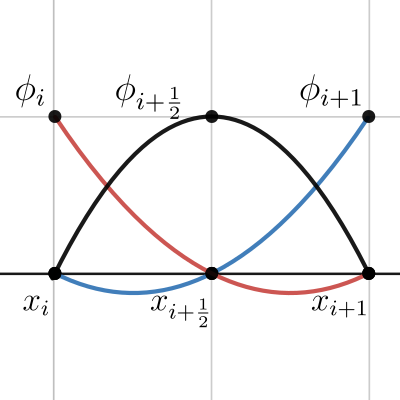

# Teoría, Práctica y Aplicaciones de los Elementos Finitos
## Tarea I
### Curso de Posgrado en Matemáticas-UNAM

> Profesor: Daniel Castañon Quiroz. daniel.castanon@iimas.unam.mx

> Alumno: Mario Rafael Nolasco Estrada. mnolasco@ciencias.unam.mx

# Problema 3


Obtener el interpolador $v_I(x)$ de la funcion $v(x)= \cos(4\pi x)$ para el intervalo $D:= (0,1)$ utilizando los elementos finitos de Lagrange de segundo orden. 

* Obtener entonces la tasa de convergencia para el error $e:= v_I-v$ en la norma $L^2(D)$ y la seminorma $H^1(D)$ para $N = 10, 20, 40, 80, 160$ donde $N$ es el número de subintervalos que dividen a $D$.





## Solución

El código comienza definiendo las funciones `u_exact(x)` y `du_exact(x)`, que devuelven el valor exacto de la solución `u(x) = cos (4π x)` y su derivada `u'(x) = -4πsin (4π x)` en un punto `x` dado.

A continuación, se define la función `error(nodes, dofs, i)` que calcula el error entre la solución exacta `u(x)` y su aproximación en el i-ésimo subintervalo, en la norma `L²` y la seminorma `H¹`, utilizando una aproximación por elementos finitos de Lagrange de segundo orden. 

La función utiliza una cuadratura Gaussiana de 3 puntos para aproximar la integral y tres funciones sombrero anónimas para aproximar la solución en cada subintervalo.

Luego, el código define varias variables y vectores para realizar un ciclo de refinamiento de la malla. En cada ciclo, se divide el intervalo `[0,1]` en un número creciente de subintervalos, se calcula la solución aproximada en cada subintervalo utilizando la función `error`, y se calcula el error cuadrático medio global. Los errores se almacenan en los vectores `L²_error_vec` y `H¹_error_vec`.

Finalmente, se calcula la tasa de convergencia del método y se almacena en los vectores `err_rate_L²` y `err_rate_H¹`. La tasa de convergencia se calcula como el logaritmo del cociente de errores cuadráticos medios consecutivos dividido por el logaritmo de `1/2` (que es la razón de refinamiento de la malla).

### Solución exacta `u_exact`


```julia
function u_exact(x)
    return cos(4π*x)
end
```


    u_exact (generic function with 1 method)


### Derivada de la solución exacta `du_exact`


```julia
function du_exact(x)
    return -4π*sin(4π*x)
end
```


    du_exact (generic function with 1 method)


### Cálculo del error de aproximación en un elemento de la malla `error_elemento`


```julia
"""
Función que calcula el error de aproximación en la norma `L²`
y en la seminorma `H¹` en un elemento de la malla.

Input:
- `nodes`: vector con los nodos de la malla
- `dofs`: vector con los grados de libertad de la solución
- `i`: índice del elemento en la malla

Output:
- `val_L²`: valor del error L² en el elemento
- `val_H¹`: valor del error H¹ en el elemento
"""
function error_elemento(nodes, dofs, i)
    xᵢ = nodes[i]
    xᵢ₊₁ = nodes[i+1]
    uᵢ = dofs[i]
    uᵢ₊₁ = dofs[i+1]
    h = 0.5*(xᵢ₊₁-xᵢ)/3
    xₘ = 0.5*(xᵢ₊₁+xᵢ)
    uₘ = u_exact(xₘ)
    
    # Definición de funciones sombrero anónimas
    hatᵢ = x -> uᵢ*(x - xₘ)*(x - xᵢ₊₁)/((xᵢ - xₘ)*(xᵢ - xᵢ₊₁))
    hatₘ = x -> uₘ*(x - xᵢ)*(x - xᵢ₊₁)/((xₘ - xᵢ)*(xₘ - xᵢ₊₁))
    hatᵢ₊₁ = x -> uᵢ₊₁*(x - xᵢ)*(x - xₘ)/((xᵢ₊₁ - xᵢ)*(xᵢ₊₁ - xₘ))
    
    dhatᵢ = x -> uᵢ*(2*x - xₘ- xᵢ₊₁)/((xᵢ - xₘ)*(xᵢ - xᵢ₊₁))
    dhatₘ = x -> uₘ*(2*x - xᵢ- xᵢ₊₁)/((xₘ - xᵢ)*(xₘ - xᵢ₊₁))
    dhatᵢ₊₁ = x -> uᵢ₊₁*(2*x - xᵢ - xₘ)/((xᵢ₊₁ - xᵢ)*(xᵢ₊₁ - xₘ))

    # Nodos de la cuadratura gaussiana de tres puntos
        x₁ = 0.5*(xᵢ₊₁-xᵢ)*(1-sqrt(3/5)) + xᵢ
        x₂ = xₘ
        x₃ = 0.5*(xᵢ₊₁-xᵢ)*(1+sqrt(3/5)) + xᵢ
    # Solución y derivada en los nodos
        u₁ = u_exact(x₁)
        u₂ = u_exact(x₂)
        u₃ = u_exact(x₃)
        du₁ = du_exact(x₁)
        du₂ = du_exact(x₂)
        du₃ = du_exact(x₃)
    # Cálculo del error L² y H¹
        val_L² = 5*(u₁ - hatᵢ(x₁) - hatₘ(x₁) - hatᵢ₊₁(x₁))^2
        val_L² += 8*(u₂ - hatᵢ(x₂) - hatₘ(x₂) - hatᵢ₊₁(x₂))^2
        val_L² += 5*(u₃ - hatᵢ(x₃) - hatₘ(x₃) -hatᵢ₊₁(x₃))^2
        val_L² = (1/9)*(0.5)*(xᵢ₊₁-xᵢ)*val_L²
        
        val_H¹ = 5*(du₁ - dhatᵢ(x₁) -dhatₘ(x₁) - dhatᵢ₊₁(x₁))^2
        val_H¹ += 8*(du₂ - dhatᵢ(x₂) -dhatₘ(x₂) - dhatᵢ₊₁(x₂))^2
        val_H¹ += 5*(du₃ - dhatᵢ(x₃) -dhatₘ(x₃) - dhatᵢ₊₁(x₃))^2
        val_H¹ = (1/9)*(0.5)*(xᵢ₊₁-xᵢ)*val_H¹
        
    return val_L², val_H¹
end
```


    error_elemento


### Cálculo de errores de aproximación en norma $L^2$ y la seminorma $H^1$ `refina`


```julia
"""
Función que calcula los errores de aproximación en norma L² y la seminorma H¹,
y las tasas de convergencia en ambas normas, para un determinado
números de ciclos de refinamiento. 

Input:
- `nI_approx_init`: número inicial de subintervalos en el mallado.
- `n_cicles`: número de ciclos de refinamiento a realizar.

Output:
- `L²_error_vec`: vector con error en L² para cada ciclo de refinamiento.
- `err_rate_L²`: vector con tasa de convergencia en L² para cada ciclo de refinamiento.
- `H¹_error_vec`: vector con error en H¹ para cada ciclo de refinamiento.
- `err_rate_H¹`: vector con tasa de convergencia en H¹ para cada ciclo de refinamiento.

"""
function refina(nI_approx_init, n_cicles)
    # Construimos un vector que contiene el número total de puntos en el mallado.
    # Para cada ciclo de refinamiento el siguiente contiene el doble de puntos que el anterior
    
    # El primer ciclo no se refina
    nI_approx_vec = [2^i*nI_approx_init for i in 0:n_cicles-1]
    
    # Vector que contiene el error en L² para cada ciclo de refinamiento
    L²_error_vec = zeros(n_cicles);
    
    # Vector que contiene el error en H¹ para cada ciclo de refinamiento
    H¹_error_vec = zeros(n_cicles);
    
    # Ciclos de refinamiento
    for k = 1:n_cicles
        # Número de subintervalos en el mallado para aproximar
        nI_approx = nI_approx_vec[k]
        
        # Nodos de la malla, vector fila
        nodes = LinRange(0, 1, nI_approx+1)
        
        # Valores exactos de la función u en los nodos de la malla
        dofs = u_exact.(nodes)
        
        # Incialización del error en L² y H¹
        error_L² = 0.0
        error_H¹ = 0.0

        ## Calculo del error ||u - u_h||_2 en la norma L²
        ## Calculo del error ||u' - u'_h||_2 en la seminorma H¹
        for i = 1:nI_approx
            errorL², errorH¹ = error_elemento(nodes, dofs, i)
            error_L² += errorL²
            error_H¹ += errorH¹
        end
        error_L² = sqrt(error_L²)
        error_H¹ = sqrt(error_H¹)
        L²_error_vec[k] = error_L²
        H¹_error_vec[k] = error_H¹
    end

    # Cálculo de la tasa de convergencia
    err_rate_L² = zeros(n_cicles)
    err_rate_L²[1] = 1
    err_rate_H¹ = zeros(n_cicles)
    err_rate_H¹[1] = 1

    for i = 2:n_cicles
        err_rate_L²[i] = log(L²_error_vec[i]/L²_error_vec[i-1])/log(1/2)
        err_rate_H¹[i] = log(H¹_error_vec[i]/H¹_error_vec[i-1])/log(1/2)
    end
    return nI_approx_vec, L²_error_vec, err_rate_L², H¹_error_vec, err_rate_H¹
end
```


    refina


### Impresión de la tabla de resultados `tabla`


```julia
using Printf
function tabla(nI, L², r_L², H¹, r_H¹)
    # Impresión de la tabla de resultados
    println("     n   L²_error   L²_err_rate   H¹_error   H¹_err_rate\n")
        s = @sprintf "| %4d | %1.3e | %1.4e | %1.3e | %1.4e |" nI[1] L²[1] r_L²[1] H¹[1] r_H¹[1];
        println(s)
    for i = 2:n_cicles
        s = @sprintf "| %4d | %1.3e | %1.4e | %1.3e | %1.4e |" nI[i] L²[i] r_L²[i] H¹[i] r_H¹[i];
        println(s)
    end
end
```


    tabla (generic function with 1 method)


```julia
# Numero inicial de subintervalos en el mallado
nI_approx_init = 10
# Número de ciclos que corre el algoritmo numérico
n_cicles = 8
```


    8


```julia
nI, L², r_L², H¹, r_H¹ = refina(nI_approx_init, n_cicles);  

tabla(nI, L², r_L², H¹, r_H¹)
```

         n   L²_error   L²_err_rate   H¹_error   H¹_err_rate
    
    |   10 | 6.590e-03 | 1.0000e+00 | 5.131e-01 | 1.0000e+00 |
    |   20 | 8.388e-04 | 2.9738e+00 | 1.301e-01 | 1.9795e+00 |
    |   40 | 1.053e-04 | 2.9935e+00 | 3.264e-02 | 1.9949e+00 |
    |   80 | 1.318e-05 | 2.9984e+00 | 8.168e-03 | 1.9987e+00 |
    |  160 | 1.648e-06 | 2.9996e+00 | 2.043e-03 | 1.9997e+00 |
    |  320 | 2.060e-07 | 2.9999e+00 | 5.107e-04 | 1.9999e+00 |
    |  640 | 2.575e-08 | 3.0000e+00 | 1.277e-04 | 2.0000e+00 |
    | 1280 | 3.219e-09 | 3.0000e+00 | 3.192e-05 | 2.0000e+00 |
    

