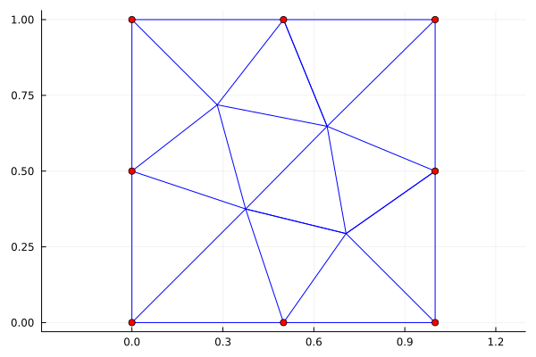
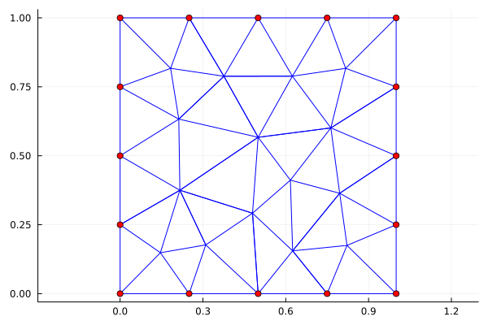
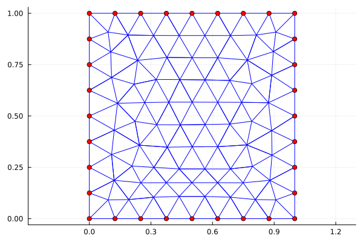
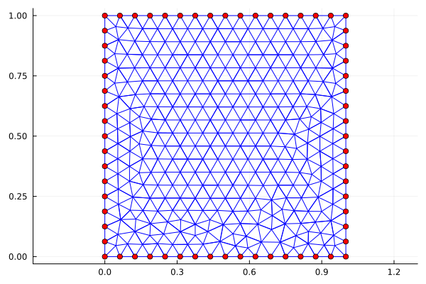
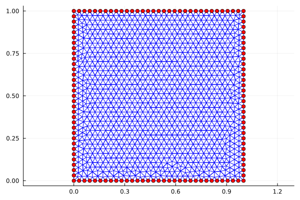

# Teoría, Práctica y Aplicaciones de los Elementos Finitos
## Tarea II
### Curso de Posgrado en Matemáticas-UNAM

> Profesor: Daniel Castañon Quiroz. daniel.castanon@iimas.unam.mx

> Alumno: Mario Rafael Nolasco Estrada. mnolasco@ciencias.unam.mx

```julia
# Cargamos paquetes 
using CSV, DataFrames, Plots, Combinatorics, LinearAlgebra, PrettyTables
```

# Funciones para mallas

* Function:  `leer_archivo(ruta::AbstractString)`


```julia
"""
## `leer_archivo(ruta::AbstractString)`

La función `leer_archivo` lee un archivo CSV en la ruta especificada 
y crea un diccionario con los datos que contiene.

## Argumentos
- `ruta::AbstractString`: La ruta del archivo CSV con los datos de la malla.

## Salida
- Un diccionario con los siguientes campos:
    - `"nbNod"` : Entero que representa el número de nodos en la malla.
    - `"POS"` : Matriz con las coordenadas de posición de cada nodo.
    - `"LINES"` : Matriz que contiene la información de caras.
    - `"TRIANGLES"` : Matriz que contiene la información de los elementos.
"""
function leer_archivo(ruta::AbstractString)
    # Cargar datos del archivo
    data = CSV.read(ruta, DataFrame)
    
    # Definir los indices de búsqueda
    idx_nbN = data[:,1].== "nbNod"
    idx_POS = data[:,1].== "POS"
    idx_LIN = data[:,1].== "LINES"
    idx_TRI = data[:,1].== "TRIANGLES"
    
    # Definir las variables
    nbNod = convert.(Int, data[idx_nbN,2][1])
    POS = convert.(Float64,[data[idx_POS,2] data[idx_POS,3]])
    LINES = convert.(Int,[data[idx_LIN,2] data[idx_LIN,3] data[idx_LIN,4]])
    TRIANGLES = convert.(Int,[data[idx_TRI,2] data[idx_TRI,3] data[idx_TRI,4] data[idx_TRI,5]])

    # Crear y retornar el diccionario
    return Dict("nbNod" => nbNod, 
                "POS" => POS, 
                "LINES" => LINES, 
                "TRIANGLES" => TRIANGLES)
end
```


    leer_archivo


* Function: `read_mesh(msh::Dict)`


```julia
"""
## `read_mesh(msh::Dict)`

La función `read_mesh` toma un diccionario `msh` que contiene información de una malla
y devuelve otro diccionario `mesh` que contiene más información de la misma malla.

## Argumentos
- `msh` : Estructura de datos con los datos de la malla. 

## Salida
- Un diccionario con los siguientes campos:
    - `nb_nodes`  : Número de nodos de la malla.
    - `nodes`  : Matriz con coordenadas de los nodos de la malla.
    - `elems_nodes_conn`  : Matriz con las conexiones nodales de los elementos de la malla.
    - `nb_elems`  : Número de elementos de la malla.
    - `nb_ofaces`  : Número de caras externas de la malla.
    - `sorted_triangles` : Matriz temporal con nodos de cada triángulo ordenados.
    - `elems_faces_conn`  : Matriz con conexiones entre los elementos y las caras.
    - `faces_elems_conn`  : Matriz con conexiones entre las caras y los elementos.
    - `faces_nodes_conn`  : Matriz con conexiones nodales de las caras.
    - `ofaces_bool`  : Matriz booleana que indica si una cara es externa.
    - `ofaces_nodes_conn`  : Matriz con conexiones nodales de las caras externas.
    - `nb_faces`  : Número de caras de la malla.
    - `onodes_bool`  : Matriz booleana que indica si un nodo está en el borde de la malla.
"""
function read_mesh(msh::Dict)
    # Crear estructura de malla
    mesh = Dict{String, Any}()

    # Obtener el número de nodos y las coordenadas de los nodos
    mesh["nb_nodes"] =  msh["nbNod"]
    mesh["nodes"] =  msh["POS"]
    
    # Obtener la conectividad de los elementos y el número de elementos
    mesh["elems_nodes_conn"] =  msh["TRIANGLES"]
    foo = size( msh["TRIANGLES"])
    mesh["nb_elems"] = foo[1]
    
    # Obtener el número de caras externas y ordenar las caras de cada elemento
    foo = size( msh["LINES"])
    mesh["nb_ofaces"] = foo[1]  # cara externa
    sorted_triangles = zeros(Int64, mesh["nb_elems"], 3)
    mesh["elems_faces_conn"] = zeros(Int64, mesh["nb_elems"], 3)
    mesh["faces_elems_conn"] = zeros(Int64, 0, 2)
    mesh["faces_nodes_conn"] = zeros(Int64, 0, 2)
    mesh["ofaces_bool"] = zeros(0, 2)   
    for elem_idx in 1:mesh["nb_elems"]
        sorted_triangles[elem_idx, :] = sort( msh["TRIANGLES"][elem_idx, 1:3])
        lfaces = zeros(Int64, 3, 2)
        lfaces[1, :] = sorted_triangles[elem_idx, 1:2]
        lfaces[2, :] = sorted_triangles[elem_idx, 2:3]
        lfaces[3, :] = sorted_triangles[elem_idx, 1:2:3]

        for lface_idx in 1:3
            cface = lfaces[lface_idx, :]
            
            # Buscar si la cara actual ya ha sido agregada anteriormente
            test1 = (mesh["faces_nodes_conn"])[:, 1] .== cface[1]
            test2 = (mesh["faces_nodes_conn"])[:, 2] .== cface[2]
            gfidx_v = (test1 ) .& (test2)
            if sum(gfidx_v)==0  # si la cara no ha sido agregada anteriormente
                mesh["faces_nodes_conn"] = vcat(mesh["faces_nodes_conn"], cface')
                gfaces_size = size(mesh["faces_nodes_conn"])
                mesh["elems_faces_conn"][elem_idx, lface_idx] = gfaces_size[1]
                # agregar nuevo elemento a la conectividad de la cara
                mesh["faces_elems_conn"] = vcat(mesh["faces_elems_conn"], [elem_idx 0])  
            else
                gfidx = findfirst(gfidx_v)
                mesh["elems_faces_conn"][elem_idx, lface_idx] = gfidx
                # agregar nuevo elemento a la conectividad de la cara
                mesh["faces_elems_conn"][gfidx, 2] = elem_idx
            end
        end
    end

    # Obtener las caras externas y su conectividad con los nodos
    mesh["ofaces_bool"] = mesh["faces_elems_conn"][:, 2] .== 0
    mesh["ofaces_nodes_conn"] = mesh["faces_nodes_conn"][mesh["ofaces_bool"], :]

    # Obtener el número de caras y crear un vector booleano para los nodos en el borde
    foo = size(mesh["faces_elems_conn"])
    mesh["nb_faces"] = foo[1]
    mesh["onodes_bool"] = falses(mesh["nb_nodes"])
    
    # Marcar nodos en la frontera
    for i in 1:mesh["nb_ofaces"]
        mesh["onodes_bool"][mesh["ofaces_nodes_conn"][i, 1]] = true
        mesh["onodes_bool"][mesh["ofaces_nodes_conn"][i, 2]] = true
    end

    return mesh
end
```


    read_mesh


* Function: `plot_mesh(mesh::Dict)`


```julia
"""
## `plot_mesh(mesh::Dict)`

La función `plot_mesh` recibe un diccionario `mesh` que representa una malla
compuesta por nodos y elementos. 

La función grafica la malla mediante la creación de una figura en la que se dibujan
los nodos como puntos y los triángulos como líneas que unen los nodos

## Argumentos
- `mesh::Dict` es una estructura de datos con los datos de la malla. 

## Salida
- La función devuelve una figura que muestra la malla graficada.
"""
function plot_mesh(mesh::Dict)
    # extraer nodos y conectividad de elementos de la malla
    nb_elems = mesh["nb_elems"]           # número de elementos en la malla
    nodes = mesh["nodes"]                 # matriz de coordenadas de nodos
    elems_nodes_conn = mesh["elems_nodes_conn"]  # matriz de conectividad de elementos
    onodes_bool = mesh["onodes_bool"]      # vector booleano que indica los nodos de contorno
    
    # graficar la malla
    p = plot()   # inicializar la figura
    for k in 1:nb_elems
        # coordenadas x de los nodos del k-ésimo elemento
        x = nodes[elems_nodes_conn[k,:][1:3],1]
        # coordenadas y de los nodos del k-ésimo elemento
        y = nodes[elems_nodes_conn[k,:][1:3],2]  
        # graficar los lados del i-ésimo elemento
        plot!(x, y, color=:blue, legend=false )  
    end
    # graficar los nodos del contorno de la malla
    scatter!(nodes[onodes_bool,1],nodes[onodes_bool,2],
        color=:red, legend=false, aspect_ratio=:equal )  
    return p   # devolver la figura
end
```


    plot_mesh


* Function: `get_h_global(mesh::Dict)`


```julia
"""
## `get_h_global(mesh::Dict)`

La función `get_h_global` recibe un diccionario `mesh` que representa una malla
compuesta por nodos y elementos. 

La función grafica la malla mediante la creación de una figura en la que se dibujan
los nodos como puntos y los triángulos como líneas que unen los nodos

## Argumentos
- `mesh::Dict` es una estructura de datos con los datos de la malla. 

## Salida
- La función devuelve el parámetro `h` global de la malla
"""
function get_h_global(mesh::Dict)
    # guardamos/renombramos variables importantes
    h_global = 0.0
    
    # obtenemos la información de la malla
    nb_elems = mesh["nb_elems"]           # número de elementos en la malla
    nodes = mesh["nodes"]                 # matriz de coordenadas de nodos
    elems_nodes_conn = mesh["elems_nodes_conn"]  # matriz de conectividad de elementos
   
    
    for i = 1:nb_elems
        # diferencia entre los puntos de cada cara
        dface_1 = nodes[elems_nodes_conn[i,1],1:2] - nodes[elems_nodes_conn[i,2],1:2]
        dface_2 = nodes[elems_nodes_conn[i,2],1:2] - nodes[elems_nodes_conn[i,3],1:2]
        dface_3 = nodes[elems_nodes_conn[i,3],1:2] - nodes[elems_nodes_conn[i,1],1:2]
        h_T = max(max(norm(dface_1), norm(dface_2)), norm(dface_3))
        h_global = max(h_global, h_T)
    end

    return h_global
end
```


    get_h_global


## Leemos las mallas


```julia
msh_filenames = ["square_1.csv"
                 "square_2.csv"
                 "square_3.csv"
                 "square_4.csv"
                 "square_5.csv" 
                 "square_6.csv"];
```


```julia
msh = leer_archivo.(msh_filenames)

# Guardamos las mallas en un arreglo
MSH = read_mesh.(msh);
```

## Graficando una malla


```julia
plot_mesh(MSH[1])
```


    

    


```julia
plot_mesh(MSH[2])
```


    

    


```julia
plot_mesh(MSH[3])
```


    

    


```julia
plot_mesh(MSH[4])
```


    

    


```julia
plot_mesh(MSH[5])
```


    

    


```julia
plot_mesh(MSH[6])
```


    


